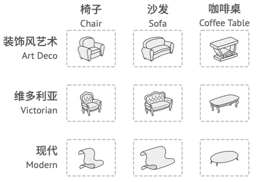
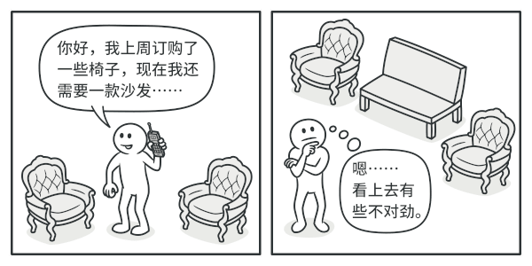

# 01 工厂模式（Factory Pattern）
LML一句话总结：  
1. 简单工厂模式  
**中央集权，要什么给中央工厂说**
通过一个工厂类`if-else`创建不同类型的对象
2. 工厂方法模式  
**分权自治，只管定义标准，具体的生产线由各分厂负责。**
让子类工厂决定创建什么对象。
3. 抽象工厂模式  
**穿搭风格，我要一整套风格统一的穿搭（产品族），别给我搭配错了。**


---

## 1. 核心差异对比表

| 模式 | 核心意图 | 解决的问题 | 对客户端的要求 |
| :--- | :--- | :--- | :--- |
| **简单工厂** | 封装创建逻辑 | 告别 `new` 的凌乱，集中管理。 | 传递一个“标签”给工厂。 |
| **工厂方法** | 延迟到子类实现 | 解决工厂类自身的臃肿，符合开闭原则。 | 选择并实例化一个具体的工厂。 |
| **抽象工厂** | 创建产品族 | 解决多个相互关联产品的配套问题。 | 面对一个能生产全套产品的工厂。 |

---

## 2. 代码演进示例

### 第一阶段：简单工厂 (Simple Factory)
**“你要什么，我给你翻牌子。”**

```python
class SimpleUIFactory:
    @staticmethod
    def create_ui(os_type):
        if os_type == "Windows":
            return WindowsButton()
        elif os_type == "Mac":
            return MacButton()
```
* **痛点**：如果你要加个 LinuxButton，你得回来改 `create_ui`。这违背了开闭原则（对扩展开放，对修改关闭）。

---

### 第二阶段：工厂方法 (Factory Method)
**“我只管定义标准，具体的生产线由各分厂负责。”**


```python
from abc import ABC, abstractmethod

# 抽象工厂类
class UIFactory(ABC):
    @abstractmethod
    def create_button(self): pass

# 具体工厂：只生 Windows 按钮
class WindowsFactory(UIFactory):
    def create_button(self): return WindowsButton()

# 具体工厂：只生 Mac 按钮
class MacFactory(UIFactory):
    def create_button(self): return MacButton()
```
* **进化点**：增加 Linux 支持？新建 `LinuxFactory` 即可，**老代码动都不用动**。

---

### 第三阶段：抽象工厂 (Abstract Factory)
**“我要一整套风格统一的家具（产品族），别给我配错了。”**




```python
class AbstractFactory(ABC):
    @abstractmethod
    def create_button(self): pass
    
    @abstractmethod
    def create_input(self): pass # 重点：它生产多个相关产品

class WindowsFactory(AbstractFactory):
    def create_button(self): return WindowsButton()
    def create_input(self): return WindowsInput() # 自动配对 Windows 风格

class MacFactory(AbstractFactory):
    def create_button(self): return MacButton()
    def create_input(self): return MacInput() # 自动配对 Mac 风格
```
* **进化点**：它保证了**产品的配套**。你不会在 Windows 系统里不小心生出一个 Mac 风格的输入框。

---

## 3. 用户使用差异（Client Side）

这是最直观的区别，看看客户端是怎么调用它们的：

```python
# --- 1. 简单工厂调用 ---
# 客户端得知道 "Windows" 这个字符串暗号
btn = SimpleUIFactory.create_ui("Windows")

# --- 2. 工厂方法调用 ---
# 客户端决定使用哪个工厂，从此不再写 if-else
factory = WindowsFactory()
btn = factory.create_button()

# --- 3. 抽象工厂调用 ---
# 客户端一次性拿到一整套生产线
factory = MacFactory()
btn = factory.create_button()
ipt = factory.create_input() # 它们是一家人，风格绝对统一
```

---

## 总结

* **简单工厂**：适合业务极简、产品变动极少的场景。
* **工厂方法**：当你发现简单工厂里的 `if-else` 多到你想哭时，就该拆分成工厂方法了。
* **抽象工厂**：当你发现你的产品不是孤立的（比如按钮必须配输入框，数据库连接必须配数据库命令），为了防止产品“串味儿”，必须用抽象工厂强制约束。
