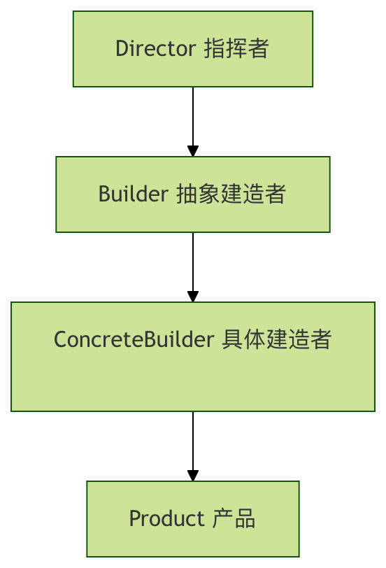

# 04 建造者模式（Builder Pattern） 
LML一句话总结：  
**构造传参太多？分步组装，随意搭配不同属性**  
将一个复杂对象的构建与它的表示分离，使得同样的构建过程可以创建不同的表示。  
“表示” = 对象的最终形态/具体样子  

## 传统构造方法的问题
```
class Computer:
    def __init__(self, cpu, memory, storage, graphics_card, monitor):
        self.cpu = cpu
        self.memory = memory
        self.storage = storage
        self.graphics_card = graphics_card
        self.monitor = monitor
    
    def __str__(self):
        return f"Computer: CPU={self.cpu}, Memory={self.memory}GB, Storage={self.storage}GB, Graphics={self.graphics_card}, Monitor={self.monitor}"

# 创建电脑对象
computer = Computer("Intel i7", 16, 512, "NVIDIA RTX 3060", "27寸 4K")
print(computer)
```
这种方法的缺点：
- 构造函数参数过多，难以维护
- 必须记住所有参数的顺序
- 创建过程不够灵活
- 代码可读性差

## 建造者模式的组成要素
建造者模式包含四个主要角色：

1. Product（产品）
要创建的复杂对象

2. Builder（抽象建造者）
定义创建产品各个部分的抽象接口

3. ConcreteBuilder（具体建造者）
实现 Builder 接口，构造和装配各个部件

4. Director（指挥者）
构建一个使用 Builder 接口的对象

## 代码实现
1. 产品类（Product）
```
class Computer:
    """电脑产品类"""
    def __init__(self):
        self.cpu = None
        self.memory = None
        self.storage = None
        self.graphics_card = None
        self.monitor = None
    
    def __str__(self):
        specs = []
        if self.cpu:
            specs.append(f"CPU: {self.cpu}")
        if self.memory:
            specs.append(f"内存: {self.memory}GB")
        if self.storage:
            specs.append(f"存储: {self.storage}GB")
        if self.graphics_card:
            specs.append(f"显卡: {self.graphics_card}")
        if self.monitor:
            specs.append(f"显示器: {self.monitor}")
        
        return "电脑配置:\n" + "\n".join(f"  - {spec}" for spec in specs)
```

2. 抽象建造者（Builder）
```
from abc import ABC, abstractmethod

class ComputerBuilder(ABC):
    """电脑建造者抽象类"""
    
    def __init__(self):
        self.computer = Computer()
    
    @abstractmethod
    def build_cpu(self):
        pass
    
    @abstractmethod
    def build_memory(self):
        pass
    
    @abstractmethod
    def build_storage(self):
        pass
    
    @abstractmethod
    def build_graphics_card(self):
        pass
    
    @abstractmethod
    def build_monitor(self):
        pass
    
    def get_computer(self):
        return self.computer
```

3. 具体建造者（ConcreteBuilder）
```
class GamingComputerBuilder(ComputerBuilder):
    """游戏电脑建造者"""
    
    def build_cpu(self):
        self.computer.cpu = "Intel i9-13900K"
    
    def build_memory(self):
        self.computer.memory = 32
    
    def build_storage(self):
        self.computer.storage = 2000  # 2TB
    
    def build_graphics_card(self):
        self.computer.graphics_card = "NVIDIA RTX 4090"
    
    def build_monitor(self):
        self.computer.monitor = "32寸 4K 144Hz"

class OfficeComputerBuilder(ComputerBuilder):
    """办公电脑建造者"""
    
    def build_cpu(self):
        self.computer.cpu = "Intel i5-13400"
    
    def build_memory(self):
        self.computer.memory = 16
    
    def build_storage(self):
        self.computer.storage = 512
    
    def build_graphics_card(self):
        self.computer.graphics_card = "集成显卡"
    
    def build_monitor(self):
        self.computer.monitor = "24寸 1080P"
```

4. 指挥者（Director）

```
class ComputerDirector:
    """电脑建造指挥者"""
    
    def __init__(self, builder):
        self.builder = builder
    
    def construct_computer(self):
        """构建电脑的完整过程"""
        self.builder.build_cpu()
        self.builder.build_memory()
        self.builder.build_storage()
        self.builder.build_graphics_card()
        self.builder.build_monitor()
    
    def get_computer(self):
        return self.builder.get_computer()
```

使用示例
```
def main():
    print("=== 建造者模式演示 ===\n")
    
    # 创建游戏电脑
    print("1. 构建游戏电脑:")
    gaming_builder = GamingComputerBuilder()
    director = ComputerDirector(gaming_builder)
    director.construct_computer()
    gaming_computer = director.get_computer()
    print(gaming_computer)
    
    print("\n" + "="*50 + "\n")
    
    # 创建办公电脑
    print("2. 构建办公电脑:")
    office_builder = OfficeComputerBuilder()
    director = ComputerDirector(office_builder)
    director.construct_computer()
    office_computer = director.get_computer()
    print(office_computer)
    
    print("\n" + "="*50 + "\n")
    
    # 创建自定义电脑
    print("3. 自定义电脑构建:")
    custom_builder = CustomComputerBuilder()
    custom_builder.build_cpu("AMD Ryzen 7 7800X3D")
    custom_builder.build_memory(64)
    custom_builder.build_storage(4000)
    custom_builder.build_graphics_card("AMD RX 7900 XTX")
    custom_builder.build_monitor("34寸曲面带鱼屏")
    custom_computer = custom_builder.get_computer()
    print(custom_computer)

# 自定义建造者（可选步骤构建）
class CustomComputerBuilder:
    """自定义电脑建造者"""
    
    def __init__(self):
        self.computer = Computer()
    
    def build_cpu(self, cpu):
        self.computer.cpu = cpu
        return self  # 返回自身，支持链式调用
    
    def build_memory(self, memory):
        self.computer.memory = memory
        return self
    
    def build_storage(self, storage):
        self.computer.storage = storage
        return self
    
    def build_graphics_card(self, graphics_card):
        self.computer.graphics_card = graphics_card
        return self
    
    def build_monitor(self, monitor):
        self.computer.monitor = monitor
        return self
    
    def get_computer(self):
        return self.computer

if __name__ == "__main__":
    main()
```

## 建造者模式的变体
1. 流式接口建造者
```
class Pizza:
    def __init__(self):
        self.size = None
        self.cheese = False
        self.pepperoni = False
        self.mushrooms = False
    
    def __str__(self):
        ingredients = []
        if self.cheese: ingredients.append("芝士")
        if self.pepperoni: ingredients.append("意大利香肠")
        if self.mushrooms: ingredients.append("蘑菇")
        return f"{self.size}寸披萨，配料: {', '.join(ingredients)}"

class PizzaBuilder:
    def __init__(self, size):
        self.pizza = Pizza()
        self.pizza.size = size
    
    def add_cheese(self):
        self.pizza.cheese = True
        return self
    
    def add_pepperoni(self):
        self.pizza.pepperoni = True
        return self
    
    def add_mushrooms(self):
        self.pizza.mushrooms = True
        return self
    
    def build(self):
        return self.pizza

# 使用流式接口
pizza = (PizzaBuilder(12)
         .add_cheese()
         .add_pepperoni()
         .add_mushrooms()
         .build())
print(pizza)
```