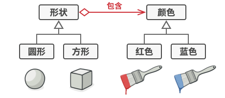

# 07 桥接模式（Bridge Pattern）
LML一句话总结：  
**排列组合+解耦抽象与实现->O(M*N)变O(M+N)** 

**抽象** = **爸爸的遗愿**  
爸爸的遗愿儿子类必须实现，不然就是不孝子

## 桥接模式图解

得实现O(M*N)这么多种的类

把共性的属性**抽象**一下，就变成只用实现O(M+N)种了


## 代码实现
```
from abc import ABC, abstractmethod

# --- 实现化角色 (Implementor) ---
class Color(ABC):
    """颜色接口：这是‘实现’维度的根源"""
    @abstractmethod
    def fill(self) -> str:
        pass

class RedColor(Color):
    def fill(self) -> str:
        return "红色"

class BlueColor(Color):
    def fill(self) -> str:
        return "蓝色"


# --- 抽象化角色 (Abstraction) ---
class Shape(ABC):
    """形状抽象类：它持有一个对 Color 的引用（桥梁）"""
    def __init__(self, color: Color):
        self._color = color  # 这就是“桥”

    @abstractmethod
    def draw(self):
        pass

# --- 修正抽象化角色 (Refined Abstraction) ---
class Circle(Shape):
    def draw(self):
        print(f"绘制了一个{self._color.fill()}的圆形")

class Square(Shape):
    def draw(self):
        print(f"绘制了一个{self._color.fill()}的正方形")


# --- 客户端调用 ---
if __name__ == "__main__":
    # 我们可以自由组合形状和颜色，而不需要创建‘RedCircle’类
    red = RedColor()
    blue = BlueColor()

    circle = Circle(red)
    square = Square(blue)

    circle.draw()  # 输出: 绘制了一个红色的圆形
    square.draw()  # 输出: 绘制了一个蓝色的正方形
    
    # 轻松切换颜色
    circle._color = blue
    circle.draw()  # 输出: 绘制了一个蓝色的圆形
```