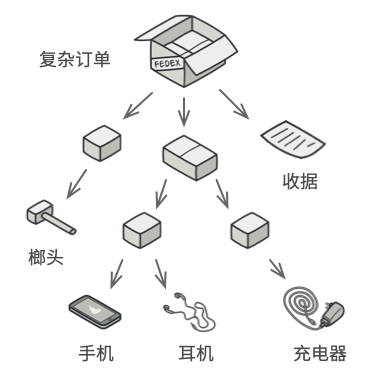

# 08 组合模式（Composite Pattern）
LML一句话总结：  
**将对象组合成树状结构，一视同仁对待单个对象和对象组合** 



## 组合模式例子
想象一下文件系统的组织结构：

- 单个文件：是最基本的单位
- 文件夹：可以包含多个文件或其他文件夹
无论你操作的是文件还是文件夹，都可以进行"打开"、"删除"、"重命名"等操作  
这种"部分-整体"的层次关系就是组合模式的典型应用场景。

## 组合模式实现
1. 组件接口(Component)
这是组合模式的核心，定义了所有对象（包括叶子节点和组合节点）的通用接口。
```
from abc import ABC, abstractmethod
from typing import List

class FileSystemComponent(ABC):
    """文件系统组件抽象基类"""
    
    def __init__(self, name: str):
        self.name = name
        self.parent = None
    
    @abstractmethod
    def display(self, indent: int = 0) -> None:
        """显示组件信息"""
        pass
    
    @abstractmethod
    def get_size(self) -> int:
        """获取组件大小"""
        pass
    
    def get_path(self) -> str:
        """获取完整路径"""
        if self.parent:
            return f"{self.parent.get_path()}/{self.name}"
        return self.name
```
2. 叶子节点(Leaf)
表示组合中的叶子对象，叶子节点没有子节点。
```
class File(FileSystemComponent):
    """文件类 - 叶子节点"""
    
    def __init__(self, name: str, size: int):
        super().__init__(name)
        self._size = size
    
    def display(self, indent: int = 0) -> None:
        """显示文件信息"""
        spaces = "  " * indent
        print(f"{spaces}&#x1f4c4; {self.name} ({self._size} bytes)")
    
    def get_size(self) -> int:
        """返回文件大小"""
        return self._size
```
3. 组合节点(Composite)
表示可以包含子组件的组合对象，定义了存储子组件的方法。
```
class Directory(FileSystemComponent):
    """目录类 - 组合节点"""
    
    def __init__(self, name: str):
        super().__init__(name)
        self._children: List[FileSystemComponent] = []
    
    def add(self, component: FileSystemComponent) -> None:
        """添加子组件"""
        component.parent = self
        self._children.append(component)
    
    def remove(self, component: FileSystemComponent) -> None:
        """移除子组件"""
        self._children.remove(component)
        component.parent = None
    
    def display(self, indent: int = 0) -> None:
        """显示目录及其所有子组件"""
        spaces = "  " * indent
        print(f"{spaces}&#x1f4c1; {self.name}/")
        
        # 递归显示所有子组件
        for child in self._children:
            child.display(indent + 1)
    
    def get_size(self) -> int:
        """计算目录总大小（包含所有子组件）"""
        total_size = 0
        for child in self._children:
            total_size += child.get_size()
        return total_size
    
    def find_component(self, name: str) -> FileSystemComponent:
        """查找指定名称的组件"""
        for child in self._children:
            if child.name == name:
                return child
            if isinstance(child, Directory):
                found = child.find_component(name)
                if found:
                    return found
        return None
```
让我们通过一个完整的例子来演示组合模式的实际应用：
```
def demonstrate_composite_pattern():
    """演示组合模式的使用"""
    
    # 创建根目录
    root = Directory("root")
    
    # 创建子目录
    documents = Directory("documents")
    pictures = Directory("pictures")
    music = Directory("music")
    
    # 创建文件
    readme = File("README.txt", 1024)
    notes = File("notes.md", 2048)
    photo1 = File("vacation.jpg", 1536000)
    photo2 = File("family.png", 2048000)
    song1 = File("song1.mp3", 4096000)
    song2 = File("song2.mp3", 5120000)
    
    # 构建目录结构
    root.add(readme)
    root.add(documents)
    root.add(pictures)
    root.add(music)
    
    documents.add(notes)
    
    pictures.add(photo1)
    pictures.add(photo2)
    
    music.add(song1)
    music.add(song2)
    
    # 显示整个文件系统结构
    print("=== 文件系统结构 ===")
    root.display()
    
    print("\n=== 大小统计 ===")
    print(f"根目录总大小: {root.get_size()} bytes")
    print(f"图片目录大小: {pictures.get_size()} bytes")
    print(f"音乐目录大小: {music.get_size()} bytes")
    
    print("\n=== 路径信息 ===")
    print(f"文件路径: {photo1.get_path()}")
    print(f"目录路径: {pictures.get_path()}")
    
    print("\n=== 查找组件 ===")
    found = root.find_component("song1.mp3")
    if found:
        print(f"找到文件: {found.get_path()}")

# 运行演示
if __name__ == "__main__":
    demonstrate_composite_pattern()
```
